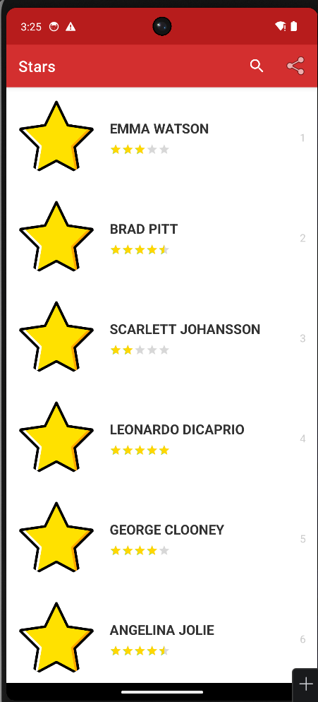
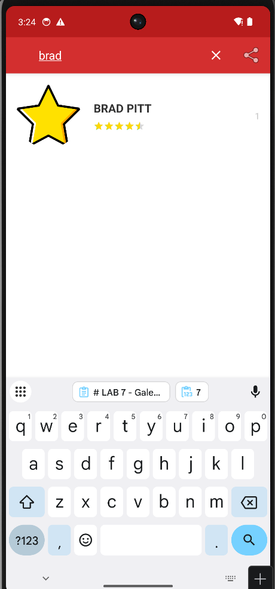
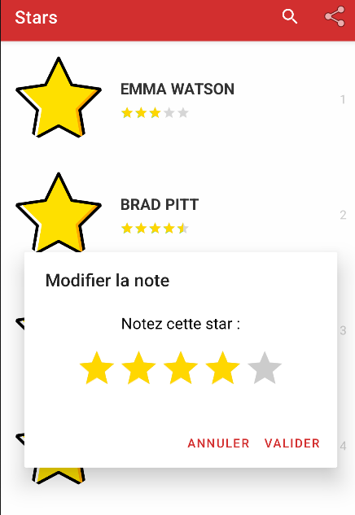
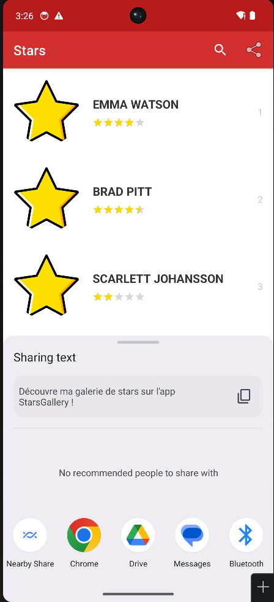

# LAB 7 - Galerie de Stars (RecyclerView, Animations & Filtrage)
**Cours :** Programmation Mobile : Android avec Java  

---

## Apercu du projet
Voici les differentes etapes de l'application :

 | Liste des Stars | Recherche & Filtrage |
 | :---: | :---: |
|  |  |
 | Affichage dynamique (RecyclerView) | Filtrage par nom en temps reel |

| Modification de Note | Partage de l'App |
| :---: | :---: |
|  |  |
| AlertDialog avec RatingBar jaune | Intent de partage natif Android |

---

## Demonstration Video
J'ai enregistre une demonstration montrant l'animation d'ouverture, le scroll fluide de la liste, la recherche d'une star particuliere et le changement de note via le popup.

[<video src="video_lab7.mp4" controls="controls" style="max-width: 100%;">
</video>](https://github.com/user-attachments/assets/bcc43ed4-9c4d-4d89-a807-f337815422f7)

---

## Explications Techniques (Ma demarche)

### 1. Structure du Projet (Packages)
Pour que le code soit propre, j'ai divise le projet en plusieurs dossiers :
- `beans` : Pour la classe `Star` (le modele).
- `dao` & `service` : Pour gerer les donnees avec le pattern **Singleton** (une seule instance de la liste en memoire).
- `adapter` : Le moteur qui fait le lien entre les donnees et la vue.
- `ui` : Pour les activites (`SplashActivity` et `ListActivity`).

### 2. L'Ecran de demarrage (Animations)
Dans la `SplashActivity`, j'ai utilise `animate().rotation().scaleX().setDuration()`. Cela permet de donner un aspect moderne des l'ouverture de l'application avec un logo qui tourne et retrecit avant de disparaitre.

### 3. Le RecyclerView & Glide
C'est le coeur du projet. Le `RecyclerView` est beaucoup plus performant qu'une simple ListView car il recycle les vues. Pour charger les photos des celebrites, j'ai utilise la bibliotheque **Glide**. Elle gere tout : le telechargement, le cache et meme l'affichage d'une image par defaut (`star.png`) si internet ne fonctionne pas.

### 4. Filtrage dynamique (SearchView)
J'ai ajoute une loupe dans la barre d'outils (Toolbar). En utilisant `OnQueryTextListener`, la liste se met a jour a chaque lettre tapee. J'ai du manipuler deux listes : une liste complete (`starsOriginales`) et une liste filtree (`starsAffichees`).

### 5. Interaction Popup (AlertDialog)
Quand on clique sur une star, une boite de dialogue apparait. J'ai cree un layout special (`star_edit_item.xml`) avec une `RatingBar` jaune interactive. Une fois la note validee, l'appel a `notifyItemChanged()` permet de rafraichir uniquement la ligne modifiee, sans recharger toute la liste.

---

